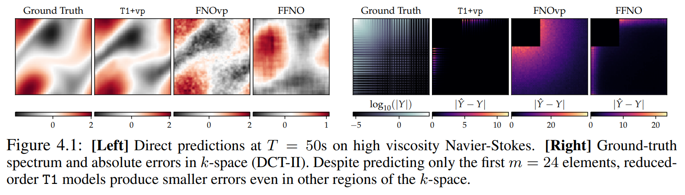

# kairos

This repository contains research code for various projects of the DiffEqML group. We use the template from `https://github.com/ashleve/lightning-hydra-template`.

## Transform Once 

**Transform Once: Efficient Operator Learning in Frequency Domain**
Michael Poli\*, Stefano Massaroli\*, Federico Berto\*, Jinkyoo Park, Tri Dao, Christopher Ré, Stefano Ermon \
[Paper](https://arxiv.org/pdf/2211.14453.pdf)

> Spectral analysis provides one of the most effective paradigms for informationpreserving dimensionality reduction, as simple descriptions of naturally occurring signals are often obtained via few terms of periodic basis functions. In this work, we study deep neural networks designed to harness the structure in frequency domain for efficient learning of long-range correlations in space or time: frequencydomain models (FDMs). Existing FDMs are based on complex-valued transforms i.e. Fourier Transforms (FT), and layers that perform computation on the spectrum and input data separately. This design introduces considerable computational overhead: for each layer, a forward and inverse FT. Instead, this work introduces a blueprint for frequency domain learning through a single transform: transform once (T1). To enable efficient, direct learning in the frequency domain we derive a variance preserving weight initialization scheme and investigate methods for frequency selection in reduced-order FDMs. Our results noticeably streamline the design process of FDMs, pruning redundant transforms, and leading to speedups of 3 x to 10 x that increase with data resolution and model size. We perform extensive experiments on learning the solution operator of spatio-temporal dynamics, including incompressible Navier-Stokes, turbulent flows around airfoils and highresolution video of smoke. T1 models improve on the test performance of FDMs while requiring significantly less computation (5 hours instead of 32 for our largescale experiment), with over 20% reduction in predictive error across tasks.

